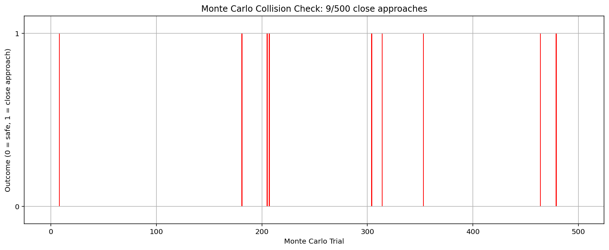
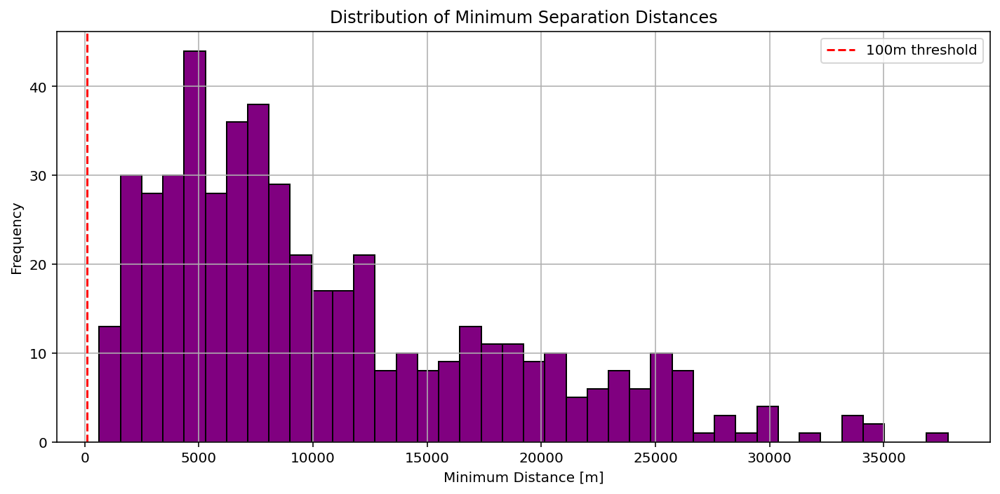
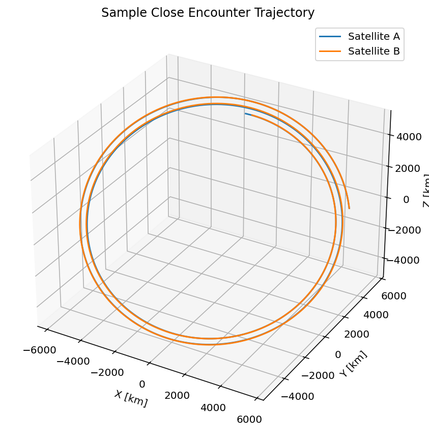

# monte carlo orbital collision
probability of a close approach between two satellites in low Earth orbit using a Monte Carlo simulation.
 
Overview
Satellite A is placed in a nominal 400 km circular orbit.

Satellite B is assigned random orbital elements with small perturbations from A’s orbit to simulate realistic orbital uncertainty.

Both satellites are propagated using two-body orbital dynamics over ~2 orbits.

In each trial, the minimum distance between the two satellites is measured.

# Bar Plot – Monte Carlo Outcomes
Red bars indicate a close approach (within 1 km), blue bars indicate safe passes.

# Histogram – Closest Approach Distances
Distribution of minimum distances (in meters) across all trials. The red dashed line marks the 100 m threshold.

# 3D Trajectory – Sample Close Encounter
A sample trajectory where Satellite A and B pass within 1 km of each other in 3D space.

